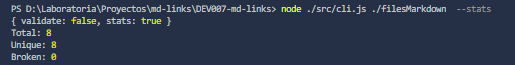

# Markdown Links

## Índice

* [1. Descripcion](#1-descripcion)
* [2. Instalacion](#2-instalacion)
* [3. Implementacion](#3-implementacion)
* [4. Diagrama de Flujo](#4-diagrama-de-flujo)

***

## 1. Descripción

Este paquete npm es una herramienta que implementa una interfaz de línea de comandos (CLI) para facilitar la validación de archivos Markdown (md) y extraer los enlaces que se encuentran en ellos. El objetivo principal es proporcionar al usuario la capacidad de analizar archivos md y obtener información relevante sobre los enlaces presentes en ellos, ademas tambien si lo desea algunas estadísticas acerca de los enlaces proporcionados .

## 2. Instalacion

Para instalar el paquete "md-links", asegúrese de tener Node.js y npm instalados en su sistema. Luego, ejecute el siguiente comando en su terminal o línea de comandos:
### Con Npm
 <code> npm i md-linksjdb </code>

### Con Git 

 `git clone https://github.com/Dahiana-moreno/DEV007-md-links.git`
 
## 3. Implementacion
 
 Para comenzar a utilizar la libreria debemos primero instalarla con el comando 'md.links'.

 `md-links`

Ya que el paquete esta instalado podemos utilizar la siguiente linea de comado:

`md-links <path-to-file> [options]`

Se debe reemplazar el `path-to-file` por la ruta real del archivo en el que se desea buscar el/los enlaces. 

### Opciones 

  - `--validate`: Esta opción valida los enlaces encontrados, verificando si están activos y accesibles. Devuelve información sobre el estado de cada enlace en caso de ser funcional o no.

  - `--stats`: Esta opción muestra estadísticas generales sobre los enlaces encontrados en el archivo, como el número total de enlaces.
  
  Puedes combinar ambas opciones para obtener validaciones y estadísticas al mismo tiempo.

Ejemplos del uso de opciones:

- Para buscar enlaces y validarlos:

`md-links <path-to-file> --validate`
  

- Para buscar enlaces y obtener estadísticas:

`md-links <path-to-file> --stats`
 

- Para buscar enlaces, validarlos y obtener estadísticas:

`md-links <path-to-file> --validate --stats`

`md-links <path-to-file> --stats --validate`

## 4. Diagrama de Flujo
### Diagrama Api

### Diagrama Cli
 
